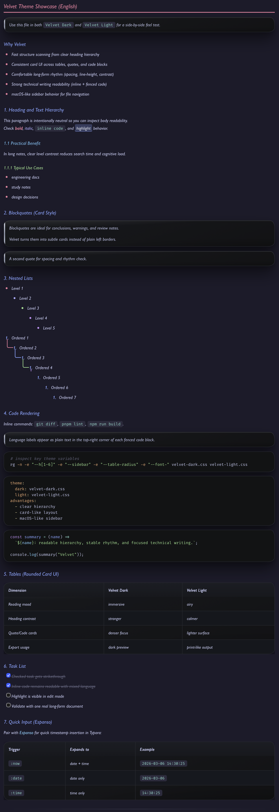
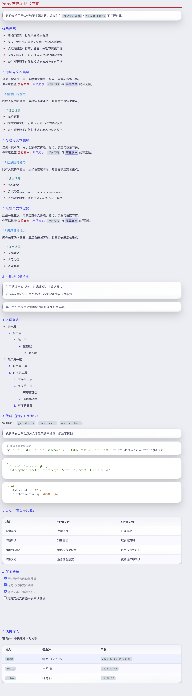

# Velvet Typora Theme

`Velvet` 是一套双主题 Typora 皮肤：`velvet-dark.css` + `velvet-light.css`。
定位是“高辨识度层级 + 长文舒适阅读 + 代码友好”。

## 主题亮点

- 双主题统一设计语言：Dark 夜读沉浸，Light 日读清爽
- 标题层级清晰：颜色分层明显，长文扫描更快
- 卡片化区块：表格 / 引用 / 代码块统一圆角、边框、阴影
- macOS 风格侧栏：文件树背景、悬浮、选中态更接近 Finder
- 深层列表可读性强：多层嵌套引导线更清晰
- 任务清单体验完善：已勾选项自动删除线
- 中英文混排优化：正文与标题优先中文圆体 + 英文字体搭配

### 动态引导线：

<video src="./videos/list.mp4" controls=""></video>

### Task

<video src="./videos/task.mp4" controls=""></video>

### 添加时间戳

<video src="./videos/time.mp4" controls=""></video>

## 文件结构

```text
.
├── velvet-dark.css
├── velvet-light.css
├── espanso-base.yml                # 可选：Espanso 快捷输入配置
├── example/
│   ├── example-theme-zh.md
│   └── example-theme-en.md
├── fonts/
│   ├── ChillRoundF.ttf
│   ├── Gill Sans Nova.ttf
│   └── FuraCode Nerd Font.ttf
└── videos/
    ├── list.mp4
    ├── task.mp4
    └── time.mp4
```

## 安装

1. 打开 Typora 主题目录。
2. 复制 `velvet-dark.css`、`velvet-light.css` 到主题目录。
3. （可选）安装 `fonts/` 目录中的字体文件到系统字体库。
4. 在 Typora 中切换到对应主题。

常见主题目录：

- macOS: `~/Library/Application Support/abnerworks.Typora/themes/`
- Windows: `%APPDATA%\\Typora\\themes\\`
- Linux: `~/.config/Typora/themes/`

## 推荐字体

仓库已提供可选字体文件（见 [`fonts/`](./fonts/)），也可直接使用系统字体回退。

- 正文/标题：`Gill Sans Nova` + `ChillRoundF`
- 代码：`FuraCode Nerd Font`（含 Nerd 图标支持）

如果缺失会自动回退到系统字体栈。

## 当前视觉风格（v3）

- 去黄系标题文本配色（非代码区域）
- 表格圆角卡片化（头部渐变、斑马纹、hover）
- 引用块与代码块统一卡片风格
- 侧栏升级为 macOS 同款灰阶+蓝色选中态
- 代码块语言标签：纯文字样式，右上角显示，不遮挡内容
- 修复 `pre` 选择器过宽导致 CodeMirror 行级条纹的问题

## 快速预览

建议分别用 `Velvet Dark` 和 `Velvet Light` 打开：

- [example-theme-zh.md](./example/example-theme-zh.md)
- [example-theme-en.md](./example/example-theme-en.md)

## 搭配工具（可选，非必须）：Espanso 快捷输入

> 这部分是增强体验配置，不影响主题本身使用。

Espanso 官方下载/安装地址：

- https://espanso.org/install/

Espanso 配置说明（官方文档）：

- https://espanso.org/docs/get-started/

安装 Espanso 后，可在 Typora 中实现 `快速插入时间戳`。
先查看你的 Espanso 配置目录（下文用 `$CONFIG` 表示）：

```bash
espanso path
```

把仓库里的 [`espanso-base.yml`](./espanso-base.yml) 覆盖到 `$CONFIG/match/base.yml`：

```bash
# macOS
cp espanso-base.yml "$HOME/Library/Application Support/espanso/match/base.yml"

# Linux
cp espanso-base.yml "$HOME/.config/espanso/match/base.yml"

# Windows PowerShell
# Copy-Item .\espanso-base.yml "$env:APPDATA\espanso\match\base.yml"

espanso restart
```

| 输入 | 替换为 | 示例 |
|---|---|---|
| `:now` | 年-月-日 时:分:秒 | `2026-03-06 14:30:25` |
| `:date` | 年-月-日 | `2026-03-06` |
| `:time` | 时:分:秒 | `14:30:25` |

> MacOS首次使用需在 **系统设置 → 隐私与安全性 → 辅助功能** 中授权 Espanso。

## 可定制入口

优先调整 `:root` 变量即可快速改风格：

- 标题与正文颜色：`--h1` ~ `--h6`、`--fg-primary`
- 卡片风格：`--table-radius`、`--table-shadow`
- 侧栏风格：`--sidebar-*`
- 字体：`--font-body`、`--font-heading`、`--font-code`

## 示例图片：




